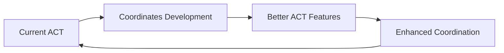

# ACT Development Process & Implementation Roadmap

## 🎯 Development Philosophy

ACT development follows a **meta-recursive approach**: we use multi-agent coordination to build the multi-agent coordination system. This creates a self-improving feedback loop where better coordination tools enable better development of coordination tools.

## 📋 Implementation Phases

### Phase 1: Foundation Layer (Weeks 1-4)
**Goal**: Build core coordination infrastructure

#### Week 1: Core Service Architecture
```typescript
// Sprint objectives
✅ Database schema design and implementation
✅ Basic REST API with authentication
✅ Agent registry and lifecycle management
✅ Simple task creation and assignment
✅ WebSocket connection handling
```

**Key Deliverables:**
- PostgreSQL database with core tables
- Node.js/TypeScript service with basic CRUD operations
- Agent registration and heartbeat system
- Simple task queue implementation

**Success Criteria:**
- Multiple agents can register and maintain connections
- Tasks can be created and assigned to agents
- Basic real-time communication via WebSocket

#### Week 2: Event-Driven Architecture
```typescript
// Sprint objectives
✅ Kafka integration for event streaming
✅ Event bus implementation
✅ Real-time state synchronization
✅ Basic conflict detection
✅ File system monitoring setup
```

**Key Deliverables:**
- Event sourcing system with Kafka
- Redis-based distributed state management
- File watcher service for code changes
- Conflict detection algorithms

**Success Criteria:**
- Events flow reliably between components
- State synchronizes across multiple agents in real-time
- File changes trigger appropriate agent notifications

#### Week 3: Agent Client SDK
```python
# Python SDK implementation
from agentmix_act import ACTClient

client = ACTClient(
    agent_id="claude_code_v1",
    capabilities=["python", "backend", "debugging"],
    server_url="ws://localhost:8080"
)

# Auto-register and start coordination
await client.start()
```

**Key Deliverables:**
- Python SDK with full ACT protocol support
- JavaScript/TypeScript SDK for web-based agents
- SDK documentation and examples
- Integration tests

**Success Criteria:**
- Agents can seamlessly connect using SDK
- All protocol operations work reliably
- SDK handles reconnection and error recovery

#### Week 4: Basic Task Coordination
```typescript
// Implementation objectives
✅ Intelligent task assignment algorithm
✅ Dependency management system
✅ Progress tracking and reporting
✅ Simple conflict resolution
✅ Basic performance metrics
```

**Key Deliverables:**
- Task assignment engine with capability matching
- Dependency graph management
- Progress tracking dashboard
- Conflict resolution for basic scenarios

**Success Criteria:**
- Tasks are automatically assigned to optimal agents
- Dependencies are respected in task execution
- Conflicts are detected and resolved automatically

### Phase 2: Advanced Coordination (Weeks 5-8)

#### Week 5: Autonomous Project Management
```typescript
interface ProjectDecomposition {
  analyzeRequirements(description: string): ProjectAnalysis;
  generatePhases(analysis: ProjectAnalysis): Phase[];
  createTasks(phases: Phase[]): Task[];
  assignOptimalAgents(tasks: Task[]): TaskAssignment[];
}
```

**Key Features:**
- Natural language project analysis
- Automatic phase and task generation
- Dynamic workflow creation
- Capability-based agent matching

#### Week 6: Advanced Conflict Resolution
```typescript
class AdvancedConflictResolver {
  resolveResourceContention(agents: Agent[], resource: Resource): Resolution;
  resolveDependencyDeadlock(tasks: Task[]): Resolution;
  negotiateWorkload(agents: Agent[]): WorkloadBalance;
  escalateComplexConflicts(context: ConflictContext): EscalationPlan;
}
```

**Key Features:**
- Multi-agent negotiation protocols
- Resource allocation optimization
- Deadlock detection and resolution
- Automatic escalation for complex conflicts

#### Week 7: Learning & Adaptation
```typescript
interface AdaptiveLearning {
  trackAgentPerformance(agent: Agent, task: Task, outcome: Outcome): void;
  adaptAssignmentStrategy(historicalData: PerformanceData[]): Strategy;
  optimizeWorkflows(projectHistory: Project[]): WorkflowOptimization;
  predictProjectTimelines(requirements: Requirements): Timeline;
}
```

**Key Features:**
- Agent performance tracking and analysis
- Machine learning for task assignment optimization
- Workflow pattern recognition and improvement
- Predictive project planning

#### Week 8: Enterprise Features
```typescript
interface EnterpriseFeatures {
  multiTenantSupport(): TenantManagement;
  rbacImplementation(): AccessControl;
  auditLogging(): ComplianceTracking;
  scalingStrategies(): AutoScaling;
}
```

**Key Features:**
- Multi-tenant architecture with isolation
- Role-based access control and permissions
- Comprehensive audit logging
- Auto-scaling based on project load

### Phase 3: AgentMix Integration (Weeks 9-12)

#### Week 9: AgentMix Backend Integration
```python
# Enhanced AgentMix with ACT
class AgentMixACTIntegration:
    def __init__(self):
        self.act_client = ACTClient(
            agent_id="agentmix_platform",
            capabilities=["coordination", "ui", "project_management"]
        )
        self.conversation_orchestrator = EnhancedOrchestrator()

    async def create_autonomous_project(self, description: str):
        # Let ACT decompose and coordinate the project
        project = await self.act_client.create_project(description)
        return await self.spawn_agent_team(project)
```

#### Week 10: Frontend Dashboard Enhancement
```jsx
// React components for ACT integration
function ACTProjectDashboard({ projectId }) {
  const { agents, tasks, progress } = useACTProject(projectId);

  return (
    <div className="act-dashboard">
      <AgentTeamView agents={agents} />
      <TaskCoordinationView tasks={tasks} />
      <RealTimeProgress progress={progress} />
      <ConflictResolutionPanel />
    </div>
  );
}
```

#### Week 11: Autonomous Agent Spawning
```typescript
interface AgentSpawning {
  analyzeProjectRequirements(project: Project): AgentRequirements;
  spawnOptimalAgents(requirements: AgentRequirements): Agent[];
  configureAgentCapabilities(agents: Agent[]): void;
  initiateCoordination(agents: Agent[], project: Project): void;
}
```

#### Week 12: End-to-End Integration Testing
- Full AgentMix + ACT integration testing
- Performance benchmarking
- User acceptance testing
- Documentation and training materials

### Phase 4: Advanced Features (Weeks 13-16)

#### Week 13: Cross-Platform Agent Support
- Support for additional AI providers (Gemini, Claude, etc.)
- Integration with existing development tools
- API compatibility with popular AI frameworks

#### Week 14: Advanced Analytics & Insights
- Project success prediction models
- Agent performance optimization
- Resource utilization analytics
- Cost optimization recommendations

#### Week 15: Ecosystem Integrations
- GitHub/GitLab integration
- CI/CD pipeline integration
- Slack/Discord notifications
- Jira/Linear project management sync

#### Week 16: Production Hardening
- Security penetration testing
- Performance optimization
- Disaster recovery planning
- Production deployment procedures

## 🔄 Meta-Development Process

### Self-Improving Development


**Week 1-2**: Manual coordination between Claude Code and Windsurf
**Week 3-4**: Basic ACT prototype coordinates development
**Week 5-8**: Enhanced ACT manages its own feature development
**Week 9-12**: Mature ACT coordinates complex multi-agent development
**Week 13-16**: Advanced ACT optimizes development processes in real-time

### Quality Assurance Approach

**Continuous Integration:**
```yaml
# GitHub Actions for ACT development
name: ACT CI/CD
on: [push, pull_request]
jobs:
  test:
    runs-on: ubuntu-latest
    services:
      postgres:
        image: postgres:15
      redis:
        image: redis:7
      kafka:
        image: confluentinc/cp-kafka:latest
    steps:
      - uses: actions/checkout@v3
      - uses: actions/setup-node@v3
      - run: npm install
      - run: npm run test:unit
      - run: npm run test:integration
      - run: npm run test:e2e
```

**Testing Strategy:**
- **Unit Tests**: Individual component testing (90%+ coverage)
- **Integration Tests**: Service-to-service communication
- **End-to-End Tests**: Full workflow validation
- **Performance Tests**: Load testing with multiple agents
- **Chaos Testing**: Failure scenario validation

### Documentation Standards

**Living Documentation:**
- API documentation auto-generated from code
- Architecture decisions recorded in ADRs
- User guides with interactive examples
- Video tutorials for complex workflows

**Knowledge Sharing:**
- Weekly development blog posts
- Community Discord for discussions
- Open source contributions guidelines
- Conference presentations and papers

## 📊 Success Metrics

### Development Velocity
- **Sprint Velocity**: Story points completed per sprint
- **Code Quality**: Technical debt ratio and maintainability index
- **Bug Rate**: Defects per 1000 lines of code
- **Test Coverage**: Automated test coverage percentage

### System Performance
- **Agent Coordination Speed**: Time to assign tasks to agents
- **Conflict Resolution Time**: Average time to resolve conflicts
- **System Throughput**: Concurrent projects supported
- **Uptime**: System availability percentage

### User Adoption
- **Agent Onboarding Time**: Time for new agents to integrate
- **Project Success Rate**: Percentage of projects completed successfully
- **User Satisfaction**: Net Promoter Score from developers
- **Community Growth**: Number of active contributors

## 🚀 Release Strategy

### Alpha Release (Week 8)
- Core coordination features
- Basic agent SDK
- Limited to internal testing

### Beta Release (Week 12)
- AgentMix integration
- Public API documentation
- Invited beta testers

### General Availability (Week 16)
- Production-ready deployment
- Full documentation
- Community support channels

### Continuous Delivery
- Feature flags for gradual rollouts
- A/B testing for new coordination algorithms
- Automated rollback on critical issues
- Real-time monitoring and alerting

This development process ensures that ACT is built with the same principles it embodies: autonomous coordination, continuous improvement, and collaborative intelligence.