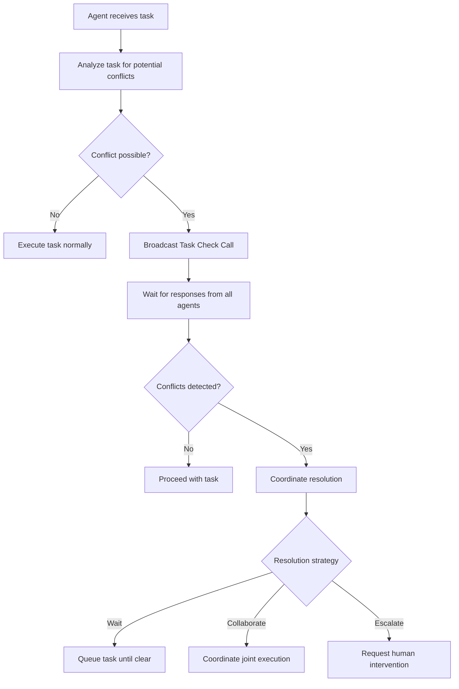

# Task Check Call System - Enterprise Conflict Resolution

**Date:** September 24, 2025
**Status:** Conceptual Design
**Priority:** Enterprise Feature

## Problem Statement

In enterprise multi-team environments, agents from isolated teams (e.g., Sensitive Data Team cannot communicate with Public Support Team) still need to coordinate to prevent destructive conflicts when working on shared codebases.

**Conflict Scenario:**
- Agent A (Sensitive Team): Starts modifying `src/auth.js`
- Agent B (Public Team): Simultaneously starts modifying `src/auth.js`
- Result: Code conflicts, broken builds, wasted effort

**Traditional Solutions Fail:**
- Multiple ACT servers = Management overhead nightmare
- Complete isolation = Conflict-prone
- Full communication = Security violations

## The Task Check Call Solution

### Core Concept: Safety-Critical Communication Override

**Task Check Call** = Emergency broadcast system for agent coordination that bypasses team isolation rules for conflict prevention only.

```
Agent A: "Task Check: Is anyone working in src/auth.js?"
Agent B: "Yes, currently debugging auth.js line 245, ETA 15 minutes"
Agent A: "Roger, will wait until completion"
```

### Why This Works

1. **Safety-Critical Override**: Like emergency frequencies that bypass radio silence
2. **Minimal Information Exchange**: Only location/conflict metadata, no business logic
3. **Universal Coordination**: Even isolated teams avoid stepping on each other
4. **User-Controlled**: Explicit security override configuration

### Implementation Architecture

#### Message Type Classification

```yaml
# ACT security model with Task Check override
message_types:
  business_communication:
    security_rules: "namespace_isolation_enforced"
    encryption: "end_to_end"
    access_control: "team_boundaries_strict"

  task_check_call:
    security_rules: "safety_critical_override"
    encryption: "metadata_only"
    access_control: "conflict_prevention_universal"
    data_allowed: ["file_path", "task_type", "status", "eta"]
    data_forbidden: ["task_details", "business_logic", "sensitive_data"]
```

#### Task Check Call Implementation

```javascript
class TaskCheckCall {
  constructor(agent, filepath) {
    this.type = "TASK_CHECK";
    this.agent_id = agent.id;
    this.namespace = agent.namespace; // for audit
    this.filepath = filepath;
    this.security_override = "CONFLICT_PREVENTION";
    this.data_classification = "COORDINATION_METADATA_ONLY";
    this.timestamp = Date.now();
  }

  // ACT server routes this to ALL agents regardless of isolation
  broadcast() {
    return ACTServer.emergencyBroadcast(this, {
      bypass_isolation: true,
      audit_log: true,
      data_sanitization: "filepath_only"
    });
  }
}
```

#### User-Defined Override Policies

```yaml
# Enterprise configuration for Task Check overrides
task_check_policies:
  file_conflict_prevention:
    enabled: true
    override_isolation: true
    justification: "Prevents code conflicts that could break entire system"
    audit_required: true

  capability_conflict_prevention:
    enabled: false # Team capabilities stay secret
    override_isolation: false
    justification: "Business logic capabilities remain isolated"

  resource_conflict_prevention:
    enabled: true
    override_isolation: true
    justification: "Prevents database/API resource contention"
    scope: ["database_access", "api_endpoints", "shared_resources"]
```

### Task Check Flow



### Security Guarantees

1. **Minimal Data Exposure**: Only coordination metadata shared
2. **Audit Trail**: All Task Check overrides logged
3. **User Control**: Override policies explicitly configured
4. **Scope Limited**: Only conflict-prevention data exchanged

### Example Task Check Scenarios

#### Scenario 1: File Conflict Prevention
```
Task Check: "Working on src/auth.js authentication bug fix"
Response: "Clear - no conflicts detected"
Action: Proceed with task
```

#### Scenario 2: Resource Conflict Prevention
```
Task Check: "Accessing user database for migration script"
Response: "Conflict - Agent_X running backup operation, ETA 20 minutes"
Action: Queue task for later execution
```

#### Scenario 3: Capability Conflict Prevention
```
Task Check: "Deploying frontend changes to production"
Response: "No capability conflicts" (business logic stays hidden)
Action: Proceed with deployment
```

### Competitive Advantage

**ACT becomes the only coordination system that solves the enterprise paradox:**
- **Maximum Security**: Teams remain isolated for sensitive operations
- **Maximum Efficiency**: Conflict prevention without communication overhead
- **Maximum Control**: User-defined override policies
- **Maximum Visibility**: Complete audit trail

### Implementation Roadmap

**Phase 1: Basic File Conflict Prevention**
- Implement Task Check Call message type
- Add security override mechanism
- Basic file path conflict detection

**Phase 2: Advanced Conflict Resolution**
- Resource conflict prevention
- Collaborative task execution coordination
- Intelligent queuing system

**Phase 3: Enterprise Features**
- Advanced audit logging
- Compliance reporting
- Multi-server federation support

### Security Considerations

1. **Data Classification**: All Task Check data classified as coordination metadata
2. **Encryption**: Task Check messages encrypted in transit
3. **Access Control**: Override policies enforced at ACT server level
4. **Compliance**: Full audit trail for enterprise compliance requirements

---

**Note:** This system transforms ACT from "agent coordination" to "intelligent enterprise orchestration" - the missing layer for secure multi-team AI agent ecosystems.

*Last Updated: September 24, 2025 by Claude Code*