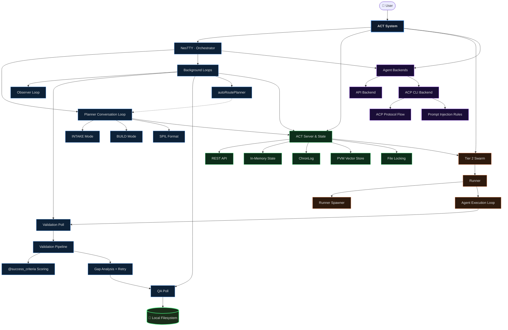

> Superseded by `architecture-flows.html/.json` + `flows-explainer.html` (repo root, freshness-registered) on 2026-06-12. Archived per DOC_STANDARDS §4 — hand-drawn master-flow predates per-agent notebooks, ACP backends, and the act_cli whitelist.

# ACT Architecture Diagrams

## Master Flow — All Concepts Flattened

Every node here represents one diagram in the full diagram set.
Block nesting shows conceptual containment. Edges show the live workflow.
The source node is the User. The end product is code in a local filesystem.
The filesystem loops back to Tier 1 — ACT observes and iterates on its own output.

---

*Detailed diagrams for each node above — to be built.*
