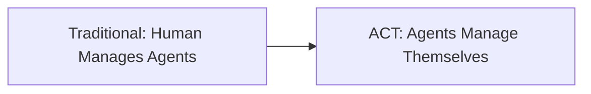

# ACT MVP: 2-Day Hackathon Version

🚀 **Revolutionary Concept, Practical Implementation**

This MVP demonstrates the core ACT coordination concept while maintaining our vision for the full system.

## Why This Approach?

**The Journey:**
1. **Manual ACT** → User manually coordinated agentmix-coordination.json between Claude Code & Windsurf
2. **It Worked!** → Manual coordination proved the concept works brilliantly
3. **User Insight** → "This needs to be a REAL thing that I don't have to manually maneuver"
4. **Our Solution** → Build autonomous coordination infrastructure
5. **Hackathon Reality** → 2 days to prove the concept

## MVP vs Full Vision

### 🎯 Core Concept (UNCHANGED)
- ✅ **Autonomous Multi-Agent Coordination** - Agents coordinate without human intervention
- ✅ **Real-Time Communication** - WebSocket-based coordination protocol
- ✅ **Dynamic Task Assignment** - Optimal agent matching based on capabilities
- ✅ **Conflict Resolution** - Automated negotiation between agents
- ✅ **Universal Protocol** - Framework-agnostic coordination layer

### 📦 MVP Scope (Tactical Decisions)

**What We're Building (2 Days):**
```typescript
interface MVPFeatures {
  agentRegistry: "In-memory agent tracking";
  taskCoordination: "Basic assignment + progress tracking";
  realTimeCommunication: "WebSocket events between agents";
  conflictResolution: "Simple rule-based resolution";
  agentMixIntegration: "Demonstration client";
  demoScenario: "3 agents building todo app";
}
```

**What We're NOT Building (Yet):**
```typescript
interface PostMVPFeatures {
  database: "PostgreSQL with full schema";
  mlOptimization: "Machine learning task assignment";
  fileWatching: "Automatic progress detection";
  enterpriseFeatures: "Multi-tenant, RBAC, scaling";
  advancedConflicts: "Complex multi-party negotiation";
  crossPlatformSDKs: "Go, Rust, Java clients";
}
```

## Strategic Benefits

### ✅ What This MVP Proves
1. **Autonomous Coordination Works** - Agents can self-organize
2. **Real Infrastructure** - Not just prompt engineering
3. **Universal Protocol** - Any platform can integrate
4. **Practical Value** - Solves real coordination problems

### 🚀 What This MVP Enables
1. **Validate Core Concept** - Test with real users
2. **Gather Feedback** - Learn what matters most
3. **Attract Investment** - Demonstrate revolutionary potential
4. **Build Community** - Show the vision, get contributors

### 📈 Post-Hackathon Path
1. **Week 1-2** → Add PostgreSQL persistence
2. **Week 3-4** → Implement file watching
3. **Week 5-8** → Advanced conflict resolution
4. **Month 2-3** → Enterprise features
5. **Month 4-6** → Cross-platform SDKs

## The Revolutionary Core

**What Makes ACT Different:**
- **First True Autonomous Coordination** - No human required in coordination layer
- **Dynamic Team Formation** - Agents form optimal teams automatically
- **Real-Time Adaptation** - Coordination evolves as project needs change
- **Universal Integration** - Works with any AI platform or framework

**The Breakthrough:**


## Hackathon Presentation Strategy

**Two Project Showcase:**
1. **ACT Protocol** - The coordination infrastructure
2. **AgentMix Enhanced** - Real platform using ACT

**Demo Flow:**
1. Show manual coordination.json approach (what led us here)
2. Launch ACT server + enhanced AgentMix
3. Live demo: "Build a todo app" with 3 coordinated agents
4. Highlight autonomous coordination happening in real-time
5. Present full vision and roadmap

## Success Metrics

**MVP Success = Proof of Concept:**
- ✅ 3+ agents coordinate autonomously
- ✅ Tasks assigned without human intervention
- ✅ Real-time conflict detection and resolution
- ✅ Audience understands the revolutionary potential

**Post-MVP Success = Market Validation:**
- 🎯 100+ developers try the system
- 🎯 10+ platforms integrate ACT
- 🎯 Community contributes to development
- 🎯 Investment interest in full system

This MVP is our **proof of concept** for a **category-defining innovation**. We ship fast, learn fast, iterate fast - while never losing sight of the revolutionary vision. 🚀